<div align="center">

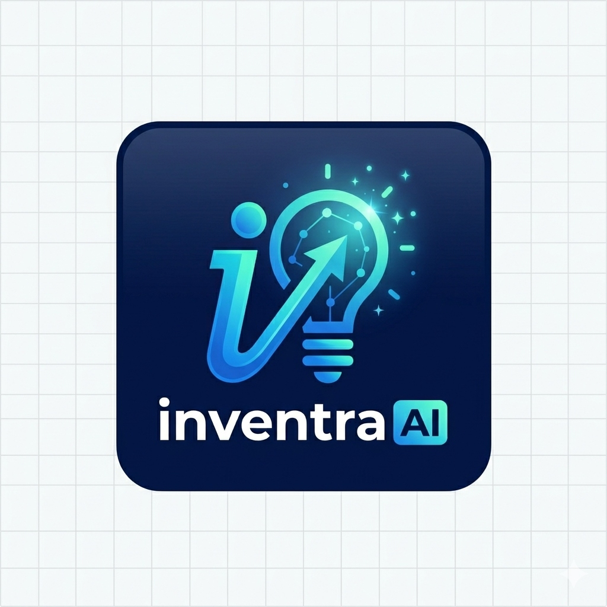

# InventraAI — No-Code AutoML & Intelligent Inventory Ecosystem

**A premium, multi-agent AI inventory suite and no-code machine learning platform designed to automate predictive modeling, demand forecasting, and store operations without writing code.**

---

[](https://react.dev)
[](https://python.org)
[](https://flask.palletsprojects.com/)
[](https://streamlit.io)
[](https://docs.celeryq.dev/)
[](https://redis.io)
[](https://min.io)
[](https://postgresql.org)
[](https://tailwindcss.com)

</div>

---

## 🌟 Overview

**InventraAI** is a state-of-the-art, end-to-end machine learning platform that democratizes predictive analytics for business intelligence, time-series forecasting, and image classification. Powered by a **rule-based AutoML engine** and a **multi-agent AI network**, the system automates the data science lifecycle: data profiling, target recommendation, model training, performance ranking, and model explainability (SHAP). 

The platform features a **Smart Inventory Suite** integrated directly with your predictive models. Business managers can log sales, track perishables (daily items), simulate local trends, compare vendor quotes, and automatically approve AI-recommended purchase orders.

---

### 📐 System Architecture

InventraAI's backend orchestrates data processing, background training, and AI reasoning pipelines while preserving low latency and dynamic responsiveness in the UI.

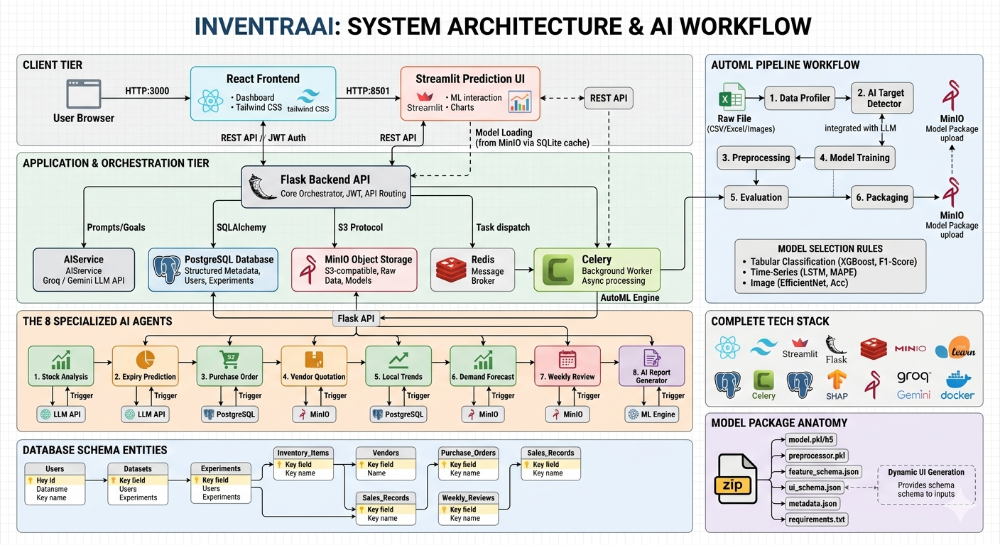

---

## 💻 Platform Tour & Experience

---

### 🌐 Main Landing Page
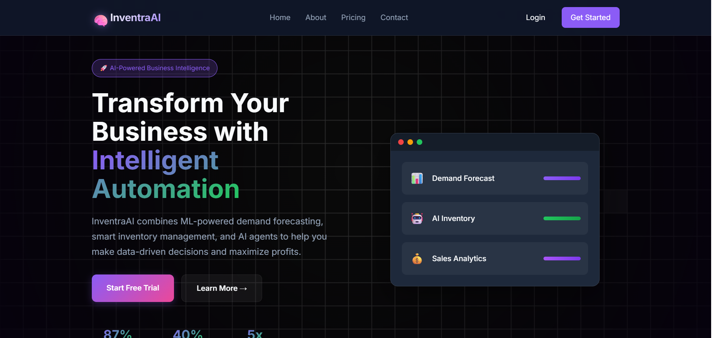
The platform landing page provides a comprehensive product introduction. It introduces users to the platform's AutoML architecture, detailing the end-to-end process of importing data, configuring goals via natural language, executing background training, and running dynamic inference models.

---

### 🔑 Secure Authentication Gateway
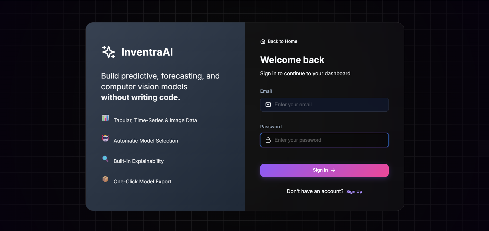
A secure gateway for user registration and sign-in. Powered by JSON Web Tokens (JWT) on the Flask backend, this system ensures that each user has access only to their own uploaded datasets, trained model artifacts, and inventory ledgers.

---

### 📊 Real-Time Operations Dashboard
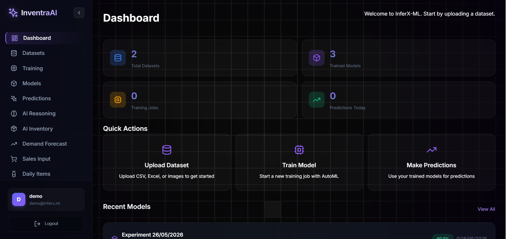
The central command center for business owners and store managers. This dashboard visualizes critical day-to-day metrics, including monthly revenue totals, active inventory item counts, notifications of upcoming local events, and a quick-view panel tracking overall stock health.

---

### 📁 Dataset Management & Auto-Profiling
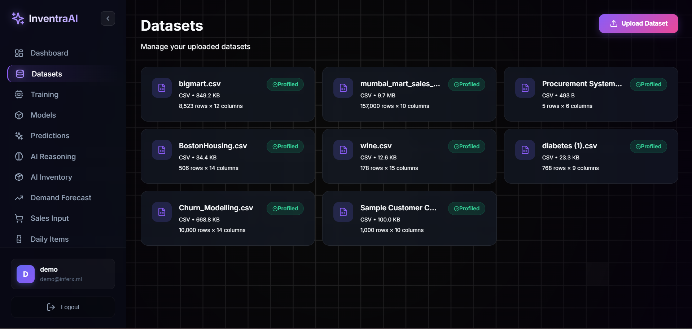
The primary data repository where users can upload structured data files (CSV, Excel) or ZIP folders containing classified images. The backend automatically saves uploads to MinIO object storage and initiates a profiling process that analyzes column names, infers data types, computes statistics, and flags missing values.

---

### ⚙️ AI Goal Analyzer & AutoML Training Launchpad
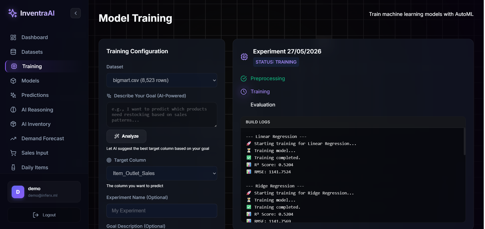
Define your machine learning goals in natural language (e.g., *"I want to predict inventory reorder quantity"*). The AI Goal Analyzer maps the prompt to your dataset schema, suggesting the optimal target column, identifying the type of ML problem (classification, regression, time-series, or clustering), and configuring the automated data preprocessing pipeline. Once confirmed, Celery workers start training the models.

---

### 🏆 Model Catalog & Performance Leaderboard
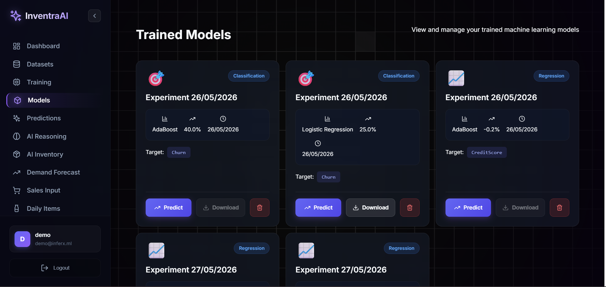
The model inventory and ranking leaderboard. When background training runs finish, they are published to this registry. Managers can inspect the model type selected (e.g., Random Forest vs XGBoost), review evaluation metrics (F1-score, Accuracy, RMSE), and activate the best model as the active predictor.

---

### 📈 Dynamic Interactive Predictions
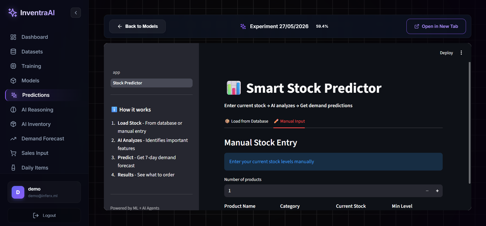
This page reads the selected model's `ui_schema.json` configuration to dynamically construct an interactive web form. Users can adjust parameters via range sliders, select categorical items from dropdown menus, and input numeric values to run predictions in real time.

---

### 🧠 Explainable AI & SHAP Reasoning
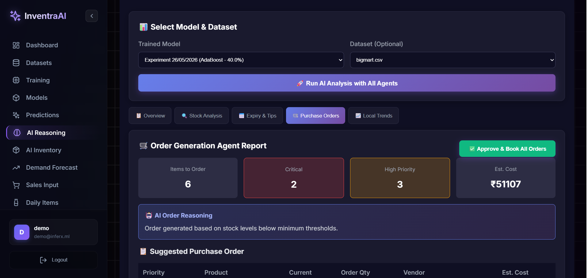
Demystifies model predictions by incorporating SHAP (SHapley Additive exPlanations) values. The dashboard renders feature contribution charts that explain which metrics most heavily influenced a prediction, paired with natural language summaries written by the AI reasoning agent.

---

### 📦 Smart Stock Health & Restocking Control
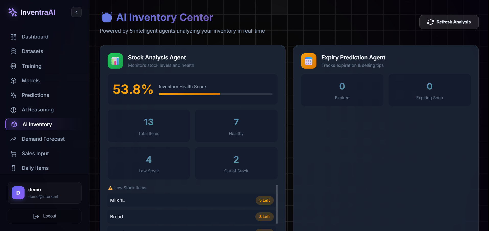
The smart restocking command hub managed by the Stock Analysis and Purchase Order Agents. It calculates the store's overall stock health score, details low-stock and out-of-stock items, and automatically drafts purchase orders to replenish inventory up to optimal target capacities.

---

### 🔮 Multi-Period Demand Forecasting
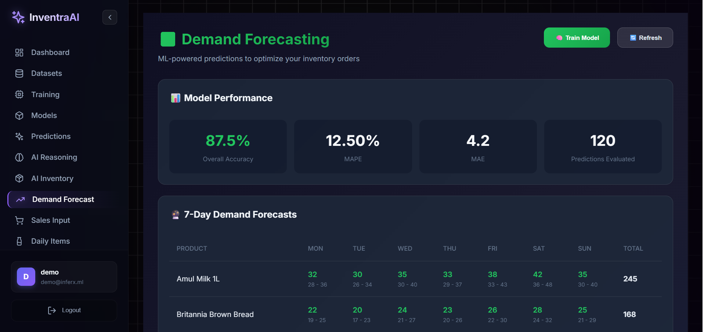
Visualizes sales forecasts generated by Prophet, ARIMA, or LSTM models. Store managers can view sales predictions over a 7-day or 30-day horizon, cross-reference them with local trends, and adjust purchase order quantities before submitting them to suppliers.

---

### 🛒 Sales Record Registry
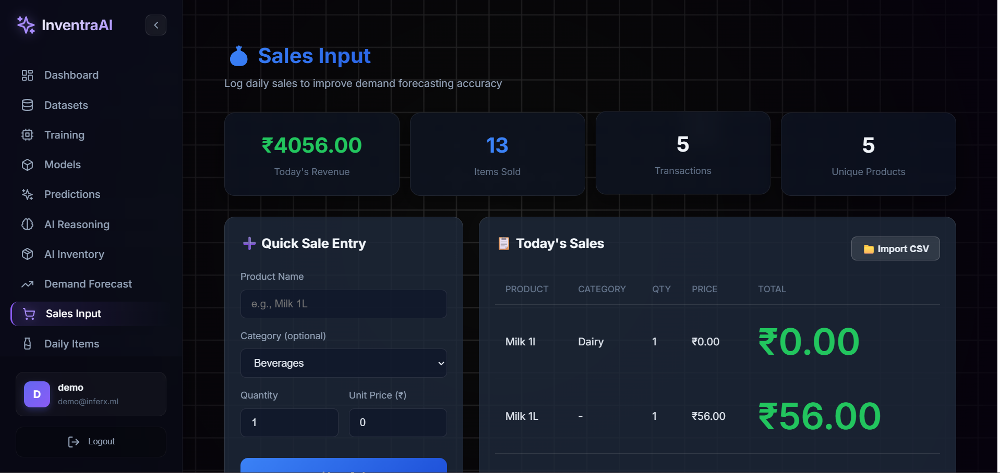
A fast transaction logging form that registers item sales. Entering sales here updates the database, decreases physical stock levels in the inventory registry, and logs chronological transaction records to retrain demand models.

---

### 🥛 Perishable Daily Items Restocking Log
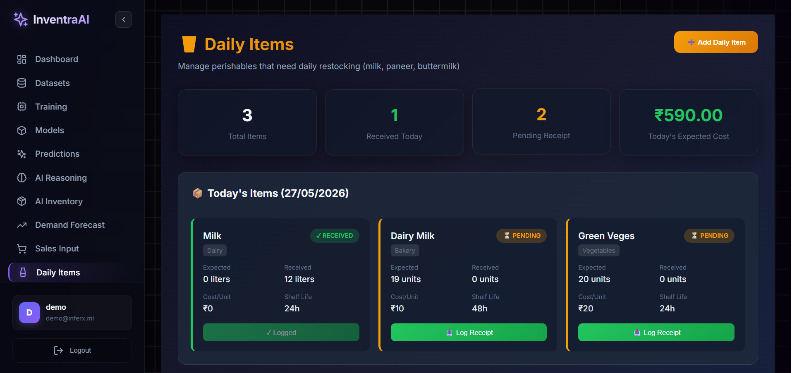
A specialized log for fast-moving, short shelf-life perishable goods (like milk, yogurt, paneer, and bakery items). Managers can check-in daily shipments, review product quality, track vendor delivery performance, and monitor shelf-life hours to minimize wastage.

---

## 🎬 Platform Demonstration

Experience InventraAI in action! Watch our comprehensive walkthrough showing the AI target detection, AutoML training, dynamic prediction forms, and the smart agent inventory loop.

<div align="center">
  <h3><a href="https://bit.ly/4a602jB" target="_blank">📺 Watch the Demo Video</a></h3>
  <br>
  <a href="https://bit.ly/4a602jB" target="_blank">
    
  </a>
  <p><i>Scan the QR Code to watch the demo directly on your mobile device.</i></p>
</div>

---

## 🛠️ Technology Stack

### 💻 Frontend & Dashboards
[](https://react.dev)
[](https://tailwindcss.com)
[](https://streamlit.io)

* **React.js & Tailwind CSS**: Main responsive dashboard interface, dataset manager, models list, and inventory management tables.
* **Streamlit App**: Lightweight prediction panels, training progress tracking, and interactive model plots.

---

### ⚙️ API & Worker Layer
[](https://flask.palletsprojects.com/)
[](https://docs.celeryq.dev/)
[](https://redis.io)

* **Flask Core**: RESTful API orchestration, routing, database migration, and MinIO synchronization.
* **Celery & Redis**: Background task workers for training algorithms in parallel without blocking client requests.

---

### 🧠 Machine Learning Core
[](https://scikit-learn.org/)
[](https://www.tensorflow.org/)
[](https://keras.io/)
[](https://shap.readthedocs.io/)

* **scikit-learn**: Random Forests, XGBoost, Logistic/Linear Regression, K-Means, and DBSCAN.
* **Prophet & statsmodels**: Advanced time-series forecasting and ARIMA models.
* **TensorFlow/Keras**: Transfer learning on MobileNet and EfficientNet for Computer Vision (image classification).
* **SHAP**: Machine learning model explainability and local feature contribution charts.

---

### 🗄️ Database & Storage
[](https://postgresql.org)
[](https://min.io)

* **PostgreSQL**: Stores platform metadata, users, dataset details, ML runs, purchase orders, sales, and weekly reports.
* **MinIO (S3 compliant)**: Securely stores uploaded files, dataset splits, preprocessor pipelines, and model binaries (`.pkl`, `.h5`).

---

### 🤖 AI Agents Framework
[](https://deepmind.google/technologies/gemini)
[](https://groq.com)

* **Groq API** (*Llama-3.3-70b-versatile*) & **Google Gemini API** (*gemini-2.5-flash*): Powers goal analysis, purchase order justification, weekly reviews, and vendor bids rankings.

---

## 🚀 Getting Started

### Prerequisites
- **Python 3.10+**
- **Node.js 18+**
- **Docker & Docker Compose**

---

### 🐳 Running with Docker (Recommended)

To spin up the entire ecosystem (React frontend, Flask backend, Streamlit dashboard, PostgreSQL, Redis, MinIO, and Celery workers) in a few commands:

1. **Clone the Repository**
   ```bash
   git clone https://github.com/bharat3214/InventraAI.git
   cd InventraAI
   ```

2. **Configure Environment Variables**
   ```bash
   cp .env.example .env
   # Edit .env and supply your GROQ_API_KEY or GEMINI_API_KEY
   ```

3. **Launch All Services**
   ```bash
   docker-compose up --build
   ```

**Access Points:**
- 🌐 **Frontend (React)**: http://localhost:3000
- 📊 **Streamlit App**: http://localhost:8501
- 🔌 **Backend API**: http://localhost:5000
- 💾 **MinIO Console**: http://localhost:9001 (admin: `minioadmin` / `minioadmin`)

---

### 🛠️ Running Locally (Development)

#### 1. Spin up Infrastructure Containers
```bash
docker-compose up -d postgres redis minio
```

#### 2. Set Up Flask Backend
```bash
cd backend
python -m venv venv
source venv/bin/activate  # Windows: venv\Scripts\activate
pip install -r requirements.txt

# Run migrations & seed demo inventory data
python migrations.py init
python migrations.py seed

# Start server
python run.py
```

#### 3. Run Celery Worker (In a new terminal, inside `backend` folder)
```bash
source venv/bin/activate  # Windows: venv\Scripts\activate
celery -A app.celery_app worker --loglevel=info
```

#### 4. Set Up React Frontend
```bash
cd frontend
npm install
npm run dev
```

#### 5. Start Streamlit App (Optional)
```bash
cd streamlit_app
pip install -r requirements.txt
streamlit run app.py
```

---


<div align="center">
  <sub>Developed with ❤️ for InventraAI. All screenshots are authentic and captured directly from the live platform.</sub>
</div>